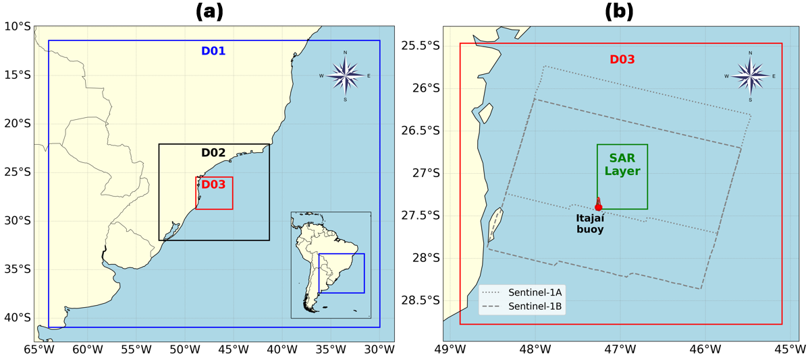
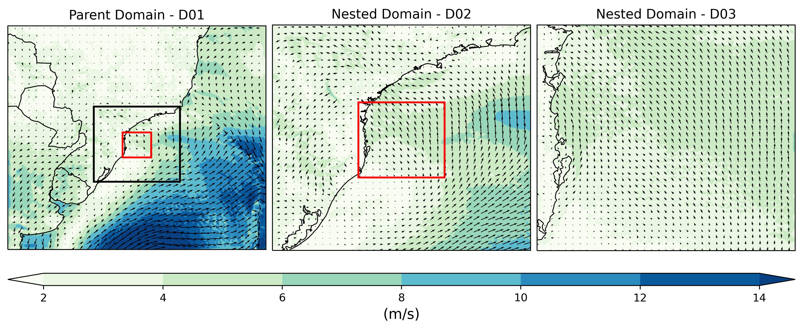
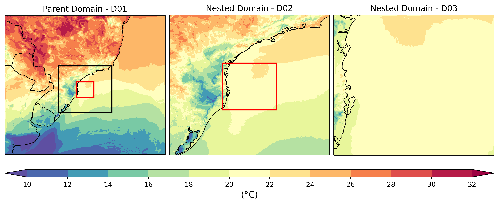
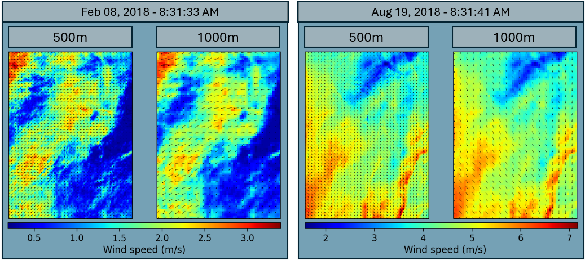

# README



## Project Overview

This repository contains a **multi‐resolution Southwestern South Atlantic (SWSA) weather dataset** integrating:
- **Numerical simulations** from the Weather Research and Forecasting (WRF) model (30 min output at 9 km, 3 km and 1 km resolution)
- **Wind retrievals** from Sentinel-1A/B SAR processed with the CMOD5 geophysical model (500 m & 1 km resolution)
- **In situ** Itajaí meteo-oceanographic buoy observations

The full dataset spans **February 2017** to **November 2018**.

---

## Data Records

The dataset is publicly available at:

> **URL:** https://www.page.com

It is organized into three main components:

1. **WRF model output**  
2. **SAR/CMOD5 wind fields**  
3. **Itajaí buoy observations**

---

### 1. WRF model output

WRF outputs are provided in NetCDF (`.nc`) format for three nested domains (D01=9 km, D02=3 km, D03=1 km), covering **06:30 UTC 06 Feb 2017** to **06:00 UTC 18 Nov 2018** at 30-minute intervals.

#### Grid dimensions

| Resolution | WRF grid (mass points) | SAR/CMOD5 grid |
|:----------:|:----------------------:|:--------------:|
| **500 m**  | –                      | 164 × 114      |
| **1 km**   | 354 × 360              | 82 × 57        |
| **3 km**   | 354 × 360              | –              |
| **9 km**   | 354 × 360              | –              |

#### WRF Variables

| Variable      | Description & Units                                                                         | Dimensions                                          |
|---------------|---------------------------------------------------------------------------------------------|-----------------------------------------------------|
| **Times**     | Time stamp for each output (calendar date, UTC)                                             | 1D (Time)                                           |
| **XLAT**      | Latitude of grid-cell centers (degrees north)                                               | 2D (south_north, west_east)                         |
| **XLONG**     | Longitude of grid-cell centers (degrees east)                                              | 2D (south_north, west_east)                         |
| **XLAT_U**    | Latitude at U-grid (zonal face) points (degrees north)                                      | 2D (south_north, west_east_stag)                    |
| **XLONG_U**   | Longitude at U-grid (zonal face) points (degrees east)                                      | 2D (south_north, west_east_stag)                    |
| **XLAT_V**    | Latitude at V-grid (meridional face) points (degrees north)                                 | 2D (south_north_stag, west_east)                    |
| **XLONG_V**   | Longitude at V-grid (meridional face) points (degrees east)                                 | 2D (south_north_stag, west_east)                    |
| **LU_INDEX**  | Land-use/land-cover classification index (integer)                                          | 2D (south_north, west_east)                         |
| **HGT**       | Terrain height above mean sea level (m)                                                     | 2D (south_north, west_east)                         |
| **LANDMASK**  | Land/sea flag (1 = land, 0 = water)                                                         | 2D (south_north, west_east)                         |
| **ZNU**       | Model vertical coordinate at full (mass) levels (m)                                         | 3D (Time, bottom_top, south_north, west_east)       |
| **ZNW**       | Model vertical coordinate at half (staggered) levels (m)                                    | 3D (Time, bottom_top_stag, south_north, west_east)  |
| **T2**        | 2 m air temperature (K)                                                                     | 3D (Time, south_north, west_east)                   |
| **TH2**       | 2 m potential temperature (K)                                                               | 3D (Time, south_north, west_east)                   |
| **SST**       | Sea-surface temperature (K)                                                                  | 3D (Time, south_north, west_east)                   |
| **PSFC**      | Surface pressure (Pa)                                                                       | 3D (Time, south_north, west_east)                   |
| **RAINC**     | Cumulative convective precipitation (kg m⁻² per interval)                                     | 3D (Time, south_north, west_east)                   |
| **RAINNC**    | Cumulative non-convective precipitation (kg m⁻² per interval)                                 | 3D (Time, south_north, west_east)                   |
| **U10**       | U-component of 10 m wind (m s⁻¹)                                                             | 3D (Time, south_north, west_east)                   |
| **V10**       | V-component of 10 m wind (m s⁻¹)                                                             | 3D (Time, south_north, west_east)                   |
| **T**         | Perturbation potential temperature (K)                                                      | 4D (Time, bottom_top, south_north, west_east)       |
| **PH**        | Perturbation geopotential (m² s⁻²)                                                          | 4D (Time, bottom_top_stag, south_north, west_east)  |
| **P**         | Perturbation pressure (Pa)                                                                  | 4D (Time, bottom_top, south_north, west_east)       |
| **U**         | U-wind component on staggered grid (m s⁻¹)                                                  | 4D (Time, bottom_top, south_north, west_east_stag)  |
| **V**         | V-wind component on staggered grid (m s⁻¹)                                                  | 4D (Time, bottom_top_stag, south_north_stag, west_east) |
| **W**         | Vertical velocity on staggered grid (m s⁻¹)                                                 | 4D (Time, bottom_top_stag, south_north, west_east)  |

#### NetCDF files summary

| File name                 | D01 (GB) | D02 (GB) | D03 (GB) | Contents                                                                                 |
|:-------------------------:|:--------:|:--------:|:--------:|:----------------------------------------------------------------------------------------|
| `data_{domain}_3D.nc`     | 52.57    | 47.97    | 43.20    | 2D & 3D surface fields (T2, TH2, SST, PSFC, RAINC, RAINNC, U10, V10, PB, PHB, LU_INDEX, HGT, LANDMASK, ZNU, ZNW) |
| `data_{domain}_T.nc`      | 30.89    | 29.19    | 29.01    | Perturbation potential temperature (4D)                                                 |
| `data_{domain}_P.nc`      | 25.89    | 24.52    | 24.12    | Perturbation pressure (4D)                                                              |
| `data_{domain}_PH.nc`     | 39.81    | 37.68    | 36.98    | Perturbation geopotential (staggered 4D)                                               |
| `data_{domain}_U.nc`      | 45.90    | 45.29    | 44.87    | U-wind component (staggered 4D)                                                         |
| `data_{domain}_V.nc`      | 45.63    | 44.85    | 44.78    | V-wind component (staggered 4D)                                                         |
| `data_{domain}_W.nc`      | 54.91    | 54.41    | 54.31    | W-vertical velocity (staggered 4D)                                                      |
| **Total size (per domain)** | **295.60** | **283.91** | **277.27** |                                                                                          |
| **Grand total size**      | |**856.78 GB** |           
---

### 2. SAR/CMOD5 wind retrievals

All SAR-derived wind fields are consolidated into two NetCDF files, covering **104 acquisition dates** (07 Feb 2017–11 Nov 2018).

#### SAR/CMOD5 Variables

| Variable    | Description                                                                  | Dimensions                          |
|-------------|------------------------------------------------------------------------------|-------------------------------------|
| **Times**   | Date and time of each SAR acquisition (UTC)                                  | 1D (Time)                           |
| **XLAT**    | Latitude at wind-field grid points (degrees north)                           | 2D (south_north, west_east)         |
| **XLONG**   | Longitude at wind-field grid points (degrees east)                           | 2D (south_north, west_east)         |
| **XSAT**    | Satellite identifier (`'S1A'` or `'S1B'`)                                    | 1D (satellite)                      |
| **U10**     | U-component of 10 m wind retrieved from CMOD5 inversion (m s⁻¹)              | 3D (Time, south_north, west_east)   |
| **V10**     | V-component of 10 m wind retrieved from CMOD5 inversion (m s⁻¹)              | 3D (Time, south_north, west_east)   |
| **WIND_SPD**| Wind speed magnitude at 10 m (m s⁻¹), computed as √(U10² + V10²)             | 3D (Time, south_north, west_east)   |
| **WIND_DIR**| Wind direction (degrees clockwise from true north), derived from U10 and V10 | 3D (Time, south_north, west_east)   |

#### NetCDF files summary

| File                      | Size  | Description                                  |
|:-------------------------:|:-----:|:---------------------------------------------|
| `data_SAR_500m.nc`        | 10 MB | SAR/CMOD5 wind fields at **500 m** resolution |
| `data_SAR_1000m.nc`       | 10 MB | SAR/CMOD5 wind fields at **1 km** resolution  |

---

### 3. Itajaí oceanographic buoy

Tabular CSV file (`itajai_buoy.csv`) with hourly in situ observations at ~4 m height, adjusted to 10 m via a logarithmic wind profile.

| Column     | Description                                               |
|:----------:|:----------------------------------------------------------|
| `Time`     | Date and time of observation (UTC)                        |
| `Latitude` | Buoy latitude (degrees north)                             |
| `Longitude`| Buoy longitude (degrees east)                             |
| `Fsr`      | Estimated surface roughness length (m)                    |
| `Wdir`     | Measured wind direction (degrees from north)              |
| `Wspd`     | Measured wind speed (m s⁻¹), adjusted to 10 m             |
| `is_SAR`   | Flag indicating whether a SAR comparison exists for that timestamp |

---

### Example Visualizations

#### WRF output examples





#### SAR/CMOD5 example



---

## Usage Notes

To load and inspect any of the NetCDF files in Python:

```python
import xarray as xr

ds = xr.open_dataset("data_D03_3D.nc")
print(ds)
